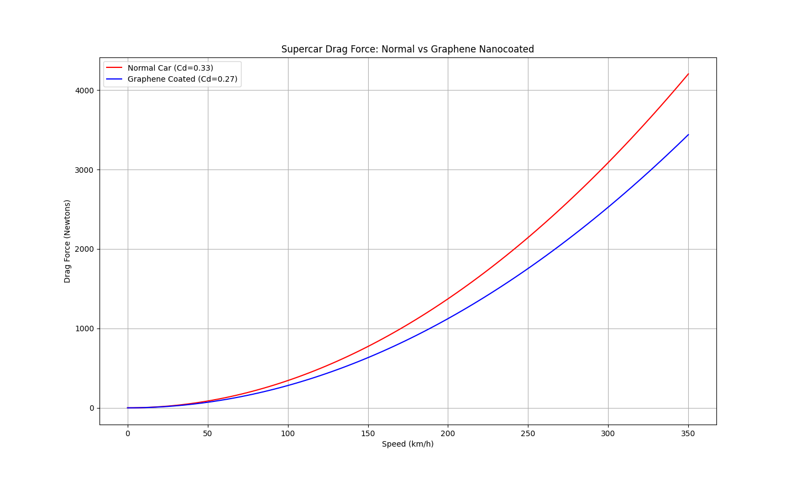

# 🏎️ Supercar Aerodynamic Drag Simulator

A Python-based physics simulation that models and compares aerodynamic drag forces on a normal supercar versus a graphene nanocoated supercar at speeds up to 350 km/h.

Built by a math student learning AI-assisted automotive simulation.

---

## 📌 What This Project Does

This simulator uses the drag force equation from fluid dynamics to calculate and visualize how much air resistance a supercar experiences at different speeds — and how graphene nanocoating reduces that drag significantly.

---

## 🧮 The Math Behind It
| Variable | Meaning | Value Used |
|----------|---------|------------|
| ρ (rho) | Air density | 1.225 kg/m³ |
| v | Velocity | 0–350 km/h |
| Cd | Drag coefficient | 0.33 (normal) / 0.27 (graphene) |
| A | Frontal area | 2.2 m² |

---

## 📊 Simulation Result



At 350 km/h:
- Normal Car: ~4,200 Newtons of drag
- Graphene Coated Car: ~3,500 Newtons of drag
- **Difference: ~700 Newtons saved!**

---

## 🛠️ Code Architecture
---

## ⚙️ How to Run

```bash
# 1. Clone the repo
git clone https://github.com/MIz-1/drag-simulator.git

# 2. Go into folder
cd drag-simulator

# 3. Create virtual environment
python3 -m venv venv
source venv/bin/activate

# 4. Install libraries
pip install matplotlib numpy

# 5. Run the simulator
python drag_simulator.py
```

---

## 📚 Libraries Used

- `numpy` — mathematical calculations
- `matplotlib` — graph visualization

---

## 👤 About

**Student Project** | Self-taught sim developer exploring AI + automotive physics.
Part of a 3-phase project series:
- ✅ Phase 1: Aerodynamic Drag Simulator ← You are here
- 🔜 Phase 2: AI Smart Suspension System
- 🔜 Phase 3: KERS Energy Optimizer