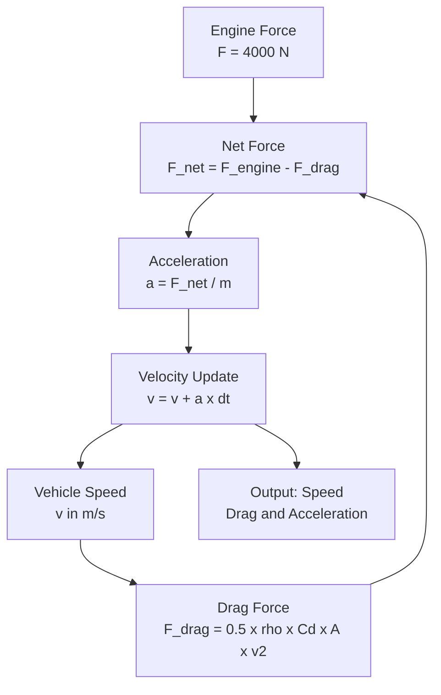

# Aerodynamic Drag Simulator

A physics-based simulation of aerodynamic drag forces on a vehicle, showing how air resistance affects acceleration and top speed.

Built as Phase 1 of my AI-Assisted Automotive Simulations series.

---

## Live Simulation Preview

---

## System Architecture

---

## Physics Model

Drag Force Formula:
F_drag = 0.5 x rho x Cd x A x v squared

Newton Second Law:
a = F_net / m = (F_engine - F_drag) / m

| Parameter | Symbol | Value |
|---|---|---|
| Vehicle Mass | m | 1200 kg |
| Drag Coefficient | Cd | 0.30 |
| Frontal Area | A | 2.2 m2 |
| Air Density | rho | 1.225 kg/m3 |
| Engine Force | F_engine | 4000 N |

---

## What The Simulation Shows

As speed increases, drag force grows with v squared.
This means doubling speed quadruples drag force.
Eventually drag equals engine force and car reaches terminal velocity.

---

## Project Structure

drag-simulator/
├── drag_simulator.py    — Main physics simulation
├── animation.py         — GIF animation generator
├── drag_animation.gif   — Animated preview
└── README.md            — This file

---

## Setup and Run

git clone https://github.com/MIz-1/drag-simulator.git
cd drag-simulator
python3 -m venv venv
source venv/bin/activate
pip install numpy matplotlib
python drag_simulator.py
python animation.py

---

## Roadmap

- [x] Phase 1 — Aerodynamic Drag Simulator
- [x] Phase 2 — AI Smart Suspension System
- [x] Phase 3 — KERS Energy Recovery System
- [x] Phase 4 — Combined Aero + Suspension + KERS

---

## About

Self-taught simulation developer exploring AI and automotive physics.
Student project — built for learning, not production.